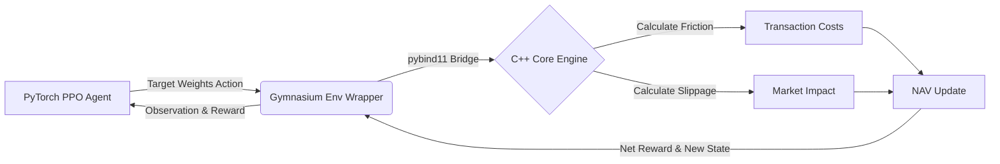

# 📈 Institutional Polyglot RL Portfolio Optimizer


## Executive Summary

This repository implements a production-grade, high-frequency Reinforcement Learning (RL) agent for dynamic portfolio rebalancing across a basket of 10 volatile equities. The system leverages a **polyglot architecture** to bridge the gap between high-level deep learning and low-level execution speed: a Proximal Policy Optimization (PPO) agent manages the portfolio through a custom `Farama Gymnasium` environment in Python, while the core environment mechanics—including the critical Net Asset Value (NAV) state transitions and friction math—are handled by a high-performance C++ backend bound via `pybind11`.

---

## 🏗️ Architecture & Data Pipeline

The pipeline is designed to eliminate Python bottlenecks during millions of environment `step()` calls.



---

## 🧮 The Core Math: Friction & Execution Simulation

Traditional mean-variance models fail in production because they assume costless trading. Our C++ engine directly calculates friction costs *before* computing the step-wise reward, enforcing real-world constraints on the RL agent.

The engine applies a rigorous two-part penalty function whenever the agent alters its portfolio weights:

### 1. Transaction Costs (Taker Fee)
A proportional cost model representing exchange taker fees. The agent pays a fixed basis point (bps) fee (e.g., 10 bps) on the absolute change in portfolio weights.

```math
\text{Cost}_{\text{taker}} = \text{taker\_fee\_bps} \times \sum_{i=1}^{N} | w_{i, t+1} - w_{i, t} | \times \text{NAV}_t
```

### 2. Market Impact (Slippage)
A non-linear penalty designed to simulate the market impact of placing large orders. We employ a $1.5$ power function to appropriately penalize significant, sudden shifts in allocation.

```math
\text{Cost}_{\text{impact}} = \text{impact\_coeff} \times \sum_{i=1}^{N} \left( | w_{i, t+1} - w_{i, t} |^{1.5} \right) \times \text{NAV}_t
```

### 3. Net Asset Value (NAV) Transition
The total rebalancing cost is immediately deducted from the portfolio's NAV prior to calculating the period's market return.

```math
\text{NAV}_{t+1} = \left( \text{NAV}_t - \text{Cost}_{\text{taker}} - \text{Cost}_{\text{impact}} \right) \times \left( 1 + \sum_{i=1}^{N} w_{i, t+1} R_{i, t} \right)
```

---

## 📊 Environment Spaces

The RL environment interfaces with the PPO agent through precisely defined continuous spaces:

| Space | Dimension | Description |
| :--- | :--- | :--- |
| **Observation** | `N * 3` | Array containing trailing returns, rolling variance/covariance, and current portfolio weights. |
| **Action** | `N` | Target weight allocations for the $N$ assets. Handled via softmax activation to ensure sum-to-one constraint and long-only positions. |

---

## 📂 Repository Structure

```text
rl/
├── CMakeLists.txt        # CMake build configuration
├── README.md             # This documentation
├── gemini.md             # Core architectural directives
├── setup.py              # pybind11 setup and compilation
├── train.py              # Training script for PPO agent
├── env.py                # Python Gymnasium environment wrapper
├── config/               # Hyperparameters and environment settings
│   └── default.yaml      # Placeholder for configs
├── docs/                 # Extended architecture notes and research
│   └── architecture.md   # Placeholder for deeper notes
├── include/              # C++ headers
│   └── engine.hpp        # Core engine declarations
├── scripts/              # Execution scripts
│   ├── run_backtest.py   # Placeholder script
│   └── train_model.py    # Placeholder script
├── src/                  # C++ source code
│   ├── bindings.cpp      # pybind11 bindings
│   └── engine.cpp        # Friction and NAV math implementation
└── tests/                # Pytest directory
    └── test_engine.py    # Placeholder for unit tests
```

---

## ⚙️ Installation & Build Instructions

To compile the C++ math engine and install the Python bindings:

```bash
# 1. Create and activate a virtual environment
python3 -m venv venv
source venv/bin/activate

# 2. Install Python dependencies
pip install pybind11 gymnasium stable-baselines3 torch numpy

# 3. Compile and install the pybind11 extension module
pip install -e .
```

To run the training script and evaluate the PPO agent:
```bash
python3 train.py
```

## Live Execution (Paper Trading)

The `scripts/live_trader.py` daemon bridges the PyTorch model to the Alpaca API for autonomous rebalancing. It continuously queries the account state, constructs the required Gym observation, queries the model for target allocations, and dispatches market orders to maintain the portfolio weights.
